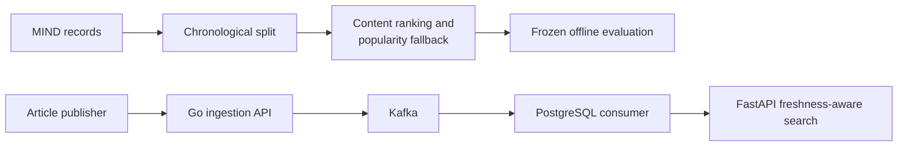
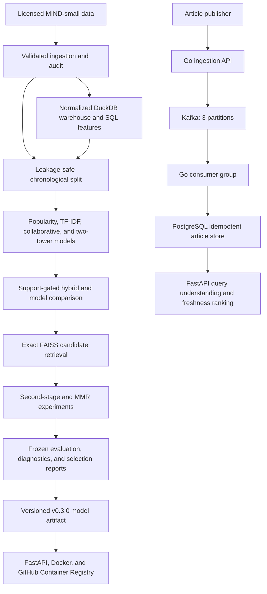

# NewsLens

[Portfolio case study](https://triasha72.github.io/Portfolio/case-newslens.html)

[Project overview](docs/PROJECT_OVERVIEW.md) — the problem, evidence boundary, reproduction check, and next validation.

[](https://github.com/triasha72/NewsLens/actions/workflows/ci.yml)
[](https://github.com/triasha72/NewsLens/actions/workflows/publish-container.yml)
[](https://github.com/triasha72/NewsLens/releases/tag/v0.3.0)
[](https://www.python.org/)
[](https://go.dev/)
[](LICENSE)

## In brief

NewsLens pairs a leakage-safe news recommender with a real-time article-search
path. The recommender is evaluated chronologically; the serving path tests
idempotency, dead letters, freshness, and consumer recovery. Current results
are offline and single-machine measurements, not user-lift or cloud-scale
claims.

## System architecture



NewsLens began with a simple question: how much of a news recommender's apparent quality survives once recommendations are evaluated in the order they could actually have been made?

It grew into a leakage-aware news recommendation system and a real-time search
platform. The offline path follows temporal leakage, sparse histories, cold-start
routing, incompatible score scales, and reproducible serving from Microsoft MIND
records to a tested API. The real-time path follows a new article through Go,
Kafka, PostgreSQL, and freshness-aware search, including the failures that can
happen between acceptance and indexing.

## Project story

**Situation.** A news recommender can appear strong when future interactions
leak into training, and an offline ranking metric says little about cold starts,
fresh articles, or failures between ingestion and indexing.

**Task.** I wanted one system that treated chronological evaluation and serving
reliability as parts of the same problem.

**Action.** I built the offline path on licensed Microsoft MIND-small records,
with chronological splits, paired uncertainty, fallback routing, subgroup
analysis, and checksummed artifacts. I then added a Go ingestion service, Kafka,
PostgreSQL idempotency, freshness-aware search, FastAPI serving, containers,
Kubernetes manifests, and failure-recovery exercises.

**Result.** The selected content-plus-fallback model reached NDCG@10 `0.3664`
and removed 927 empty rankings on the chronological validation protocol. A
learned second-stage ranker was rejected after NDCG@10 fell from `0.3826` to
`0.2750`. In a bounded local real-time run, 500 events were accepted at 1,225
events/s and sampled produced-to-indexed p95 was 78.76 ms. These are offline and
single-machine results; no live-user lift or cloud-scale claim is made.

## What was built and why

**Release:** `v0.3.0`

To answer the research question without hiding leakage or operational failure,
NewsLens combines:

- validated MIND-small ingestion and dataset auditing;
- a normalized DuckDB warehouse with SQL audit and feature queries;
- leakage-safe chronological training and validation;
- TF-IDF article search and user-history recommendation;
- a training-only popularity baseline;
- deterministic popularity fallback for cold-start and zero-signal requests;
- reproducible offline ranking evaluation;
- bootstrap confidence intervals and paired model comparison;
- subgroup, category, exposure, and failure analysis;
- versioned, checksummed model artifacts;
- artifact-backed FastAPI recommendation inference;
- liveness, readiness, request tracing, and latency reporting;
- a non-root Docker image with a health check;
- Docker Compose deployment with a read-only model volume;
- Kubernetes deployment with health probes, autoscaling, and disruption protection;
- a repeatable concurrent load runner with latency and failure reporting;
- automated Python and container validation in GitHub Actions; and
- multi-platform container publication to GitHub Container Registry.

The real-time search path adds:

- a Go ingestion API with strict event validation and bounded publish timeouts;
- Kafka with three ordered partitions and a two-member consumer group;
- transactional PostgreSQL idempotency and stale-update protection;
- bounded retries, dead-letter records, fetch backoff, and graceful shutdown;
- category, entity, and freshness query understanding;
- inspectable relevance, freshness, and popularity score components;
- Prometheus counters and lag/freshness gauges; and
- repeatable load, duplicate, DLQ, failover, and backlog-recovery exercises.

The repository contains more than 400 automated tests.

### Experiments and engineering decisions

The project preserved each frozen recommendation experiment, including the
approaches that failed their selection rules:

| Phase | Evidence-backed result |
|---|---|
| Collaborative filtering | Added a BPR baseline and support-aware comparison without replacing the production content/fallback route |
| Gated hybrid | Frozen before the official MIND-small development holdout; the measured NDCG@10 change was positive but its paired interval included zero, so no improvement is claimed |
| Two-tower retrieval | Hard-negative training improved the earlier two-tower model to NDCG@10 `0.3726` and Recall@10 `0.6142` on the internal chronological protocol |
| FAISS retrieval | Selected exact `IndexFlatIP`; it retained Recall@100 `1.0`, while the faster HNSW candidate missed the preregistered quality gate |
| Learned second-stage ranker | Rejected after NDCG@10 fell from `0.3826` to `0.2750` under the frozen Phase-05 comparison |
| Diversity and exposure | Selected deterministic MMR with lambda `0.80`; it preserved logged-candidate relevance within budget and improved semantic diversity, but did not improve global exposure concentration or serving latency |
| Online experiment design | Added fixed-horizon power planning, guardrails, sample-ratio-mismatch checks, team-draft interleaving, and offline-online divergence reporting; no live-user impact is claimed |

The released container serves the tested content-plus-fallback artifact; the
neural and reranking studies remain reproducible offline experiments. Frozen
reports live in [`reports/`](reports/), while their information boundaries and
selection rules live in [`docs/`](docs/).

The full MIND-small train and development archives were also used to validate
the ingestion-to-serving path on a local machine. The audit, artifact, API, and
Docker observations are documented in
[`docs/MINDSMALL_LOCAL_SERVING_EVIDENCE.md`](docs/MINDSMALL_LOCAL_SERVING_EVIDENCE.md);
licensed records and generated artifacts remain outside version control.

The same artifact was subsequently deployed as two ready replicas on a local
Docker Desktop Kubernetes cluster. The manifest fixes, bounded service result,
and limits of that single-node evidence are recorded in
[`docs/KUBERNETES_LOCAL_EVIDENCE.md`](docs/KUBERNETES_LOCAL_EVIDENCE.md).

The separate real-time stack was also built and exercised end to end on Docker
Desktop. In a 500-event, concurrency-20 local run, all events were accepted at
1,225 events/s; publish p99 was 44.12 ms and sampled produced-to-indexed p95 was
78.76 ms. All 25 duplicate replays were recognized. A deliberately stopped
consumer's assigned partition recovered in 5.67 seconds, a retained backlog event
became searchable 2.43 seconds after a consumer restarted, and a malformed Kafka
record reached the DLQ with its original bytes intact. These are bounded
single-machine observations, documented with limitations in
[`docs/REALTIME_LOCAL_EVIDENCE.md`](docs/REALTIME_LOCAL_EVIDENCE.md).

## Questions that shaped NewsLens

The system was not designed from a predetermined architecture checklist. Its components were added as earlier experiments exposed new questions:

- What changes when news interactions are split chronologically instead of randomly?
- How far can lexical article similarity go before a more complex representation is justified?
- What should happen when a user has no usable history or the content model has no positive signal?
- Can a fallback recover abstentions without leaking validation information?
- Are observed metric differences stable under paired resampling?
- Where does the model behave differently across history length, category, and training exposure?
- What information must be preserved to reproduce exactly the same rankings outside the training process?
- How should liveness, readiness, integrity checks, and observability behave when that model is served?

The implementation records one evidence-backed answer to each question rather
than presenting any single model as universally best.

## System architecture



The selected model uses TF-IDF content recommendations when the user history produces a positive similarity signal. Cold-start and zero-signal requests are routed to a popularity model trained only on the appropriate training partition.

Content and popularity scores are not blended because they use different, non-comparable scales.

## Key evaluation results

All models were evaluated with the same:

- chronological split;
- validation impressions;
- candidate sets;
- article catalog;
- metric implementation; and
- ranking cutoff of 10.

### Evaluation protocol

| Property | Value |
|---|---:|
| Total MIND-small training records | 156,965 |
| Chronological training records | 125,572 |
| Chronological validation records | 31,393 |
| Requested validation fraction | 20% |
| Actual validation fraction | 20% |
| Cutoff timestamp | 2019-11-13 20:36:26 |
| Temporal overlap | None |

### Model comparison

| Metric @10 | Popularity | TF-IDF content | Content + fallback |
|---|---:|---:|---:|
| NDCG | 0.2853 | 0.3594 | **0.3664** |
| MRR | 0.2308 | 0.3133 | **0.3179** |
| Recall | 0.5047 | 0.5819 | **0.5955** |
| Hit Rate | 0.5705 | 0.6610 | **0.6762** |
| Catalog Coverage | 0.0402 | 0.0719 | **0.0719** |
| Unique recommended articles | 2,061 | 3,687 | **3,687** |
| Empty rankings | 0 | 927 | **0** |

The content model handles 30,466 validation impressions, or 97.05%. The remaining 927 impressions, or 2.95%, are routed to popularity.

Fallback recovers all 927 content abstentions and reduces empty rankings from 927 to zero.

### Fallback routing

| Route | Impressions | Share |
|---|---:|---:|
| TF-IDF content | 30,466 | 97.05% |
| Popularity fallback | 927 | 2.95% |
| Empty-history fallback | 801 | 2.55% |
| Zero-signal fallback | 126 | 0.40% |
| Unknown-history fallback | 0 | 0.00% |
| Zero-profile fallback | 0 | 0.00% |

## Statistical comparison

The final fallback candidate was compared with the content-only model using aligned validation impressions and a paired nonparametric percentile bootstrap.

| Metric | Content baseline | Fallback candidate | Difference | 95% CI for difference |
|---|---:|---:|---:|---:|
| NDCG@10 | 0.3594 | 0.3664 | +0.0069 | [0.0058, 0.0081] |
| MRR@10 | 0.3133 | 0.3179 | +0.0046 | [0.0034, 0.0058] |
| Recall@10 | 0.5819 | 0.5955 | +0.0135 | [0.0119, 0.0152] |
| Hit Rate@10 | 0.6610 | 0.6762 | +0.0152 | [0.0135, 0.0170] |

Bootstrap protocol:

- 31,393 aligned evaluation impressions;
- 1,000 bootstrap replicates;
- 95% confidence level;
- random seed 42;
- impression-level paired resampling; and
- candidate-minus-baseline differences.

Every reported paired interval excludes zero under this evaluation protocol. This provides evidence of an offline metric improvement, but it does not establish online, causal, or production impact.

## Overall uncertainty

The final candidate also has deterministic impression-level bootstrap confidence intervals.

| Metric | Estimate | Lower 95% | Upper 95% | Standard error |
|---|---:|---:|---:|---:|
| NDCG@10 | 0.3664 | 0.3627 | 0.3703 | 0.0019 |
| MRR@10 | 0.3179 | 0.3140 | 0.3218 | 0.0020 |
| Recall@10 | 0.5955 | 0.5907 | 0.6003 | 0.0026 |
| Hit Rate@10 | 0.6762 | 0.6712 | 0.6815 | 0.0027 |

These intervals condition on the fixed dataset, split, candidate policy, fitted model, and metric definitions.

## Diagnostic evaluation

### History length

History segments are mutually exclusive and exhaustive. Recombining their sufficient statistics reproduces the overall metrics.

| Segment | History articles | Impressions | Share | NDCG@10 | MRR@10 | Recall@10 | Hit Rate@10 |
|---|---:|---:|---:|---:|---:|---:|---:|
| Cold start | 0 | 801 | 2.55% | 0.2954 | 0.2334 | 0.5339 | 0.6017 |
| Short | 1–4 | 3,379 | 10.76% | 0.3471 | 0.2809 | 0.5911 | 0.6324 |
| Medium | 5–9 | 4,994 | 15.91% | 0.3767 | 0.3184 | 0.6148 | 0.6676 |
| Long | 10+ | 22,219 | 70.78% | 0.3695 | 0.3265 | 0.5940 | 0.6875 |

Cold-start impressions are the weakest segment across all four relevance metrics.

### Selected category results

Category cohorts can overlap when an impression contains clicked articles from multiple categories. Category shares therefore do not sum to 100%.

| Category | Relevant impressions | NDCG@10 | Recall@10 | Hit Rate@10 |
|---|---:|---:|---:|---:|
| Weather | 1,640 | 0.4764 | 0.7359 | 0.7366 |
| Lifestyle | 6,594 | 0.3894 | 0.6016 | 0.6175 |
| News | 10,338 | 0.3361 | 0.5804 | 0.6106 |
| Sports | 3,564 | 0.3151 | 0.5287 | 0.5485 |
| Finance | 3,464 | 0.2819 | 0.5025 | 0.5141 |
| Health | 2,268 | 0.2124 | 0.3978 | 0.4114 |
| Travel | 1,920 | 0.1772 | 0.3493 | 0.3563 |

### Training exposure

Training exposure is calculated using candidate appearances from the chronological training partition only.

| Band | Training exposures | Catalog articles | Relevant impressions | NDCG@10 | Recall@10 | Hit Rate@10 |
|---|---:|---:|---:|---:|---:|---:|
| Unseen | 0 | 34,450 | 15,003 | 0.3924 | 0.6298 | 0.6655 |
| Low | 1–9 | 9,648 | 13,038 | 0.2807 | 0.5162 | 0.5512 |
| Medium | 10–99 | 4,405 | 3,012 | 0.2916 | 0.5136 | 0.5196 |
| High | 100+ | 2,779 | 8,580 | 0.2740 | 0.4697 | 0.5169 |

“Unseen” means zero candidate appearances in the chronological training partition. It does not mean that article text is unavailable.

### High-score failure inspection

NewsLens performs route-aware inspection of top-10 failures. TF-IDF similarities and popularity click counts use different scales, so high-score thresholds are calculated separately for each route.

| Property | Result |
|---|---:|
| Evaluated impressions | 31,393 |
| Score-eligible impressions | 31,162 |
| Top-10 misses | 10,164 |
| High-score misses | 1,222 |
| Retained deterministic examples | 50 |
| TF-IDF threshold | 0.1918 |
| Popularity threshold | 1,007 clicks |

These examples support qualitative debugging. Recommendation scores are not treated as calibrated probabilities.

Full results are available in:

- [`docs/EVALUATION.md`](docs/EVALUATION.md)
- [`reports/fallback_metrics.json`](reports/fallback_metrics.json)
- [`reports/content_metrics.json`](reports/content_metrics.json)
- [`reports/popularity_metrics.json`](reports/popularity_metrics.json)

## Implemented functionality

### Data ingestion and audit

- validated `news.tsv` and `behaviors.tsv` loaders;
- malformed-schema and invalid-label rejection;
- duplicate-identifier detection;
- timestamp, history, candidate, and click parsing;
- preservation of empty histories as valid cold-start records;
- reproducible train and development audit reports; and
- exclusion of licensed raw data from Git and Docker images.

### DuckDB analytical warehouse

- normalized `articles`, `behavior_events`, `user_history`, and
  `candidate_interactions` tables;
- relational primary-key and reference validation;
- source-file SHA-256 provenance and schema metadata;
- atomic, failure-safe warehouse replacement;
- a persisted SQL article-engagement view;
- SQL-derived warehouse summaries; and
- cutoff-aware article feature extraction that excludes validation-time events.

See [`docs/DATA_WAREHOUSE.md`](docs/DATA_WAREHOUSE.md) for the schema, query
examples, and scope of the data layer.

### Search and recommendation

- training-only popularity ranking;
- TF-IDF article search;
- TF-IDF user-history recommendation;
- content-to-popularity fallback;
- deterministic tie handling;
- candidate-set restrictions; and
- exclusion of already-viewed articles when applicable.

### Evaluation

- leakage-safe chronological splitting;
- binary NDCG@K, MRR@K, Recall@K, and Hit Rate@K;
- catalog coverage;
- model-independent candidate-ranking evaluation;
- deterministic JSON reports;
- history-length segmentation;
- clicked-category analysis;
- training-exposure analysis;
- overall bootstrap confidence intervals;
- paired bootstrap model comparison; and
- high-confidence failure inspection.

### Model artifacts

- full-training-split model export;
- semantic artifact versions;
- typed Pydantic metadata;
- recorded training cutoff and parameters;
- manifest-based file inventory;
- SHA-256 integrity verification;
- rejection of missing, corrupt, incompatible, or unexpected files;
- immutable artifact directories; and
- load-once API startup behavior.

Generated artifacts are excluded from Git because they contain information derived from the licensed MIND dataset.

Only load artifacts produced by a trusted NewsLens training workflow. The artifact uses joblib/pickle-compatible deserialization; checksums protect against accidental corruption but cannot make an untrusted pickle safe.

### FastAPI service

- application-factory architecture;
- verified artifact loading during startup;
- typed request and response schemas;
- automatic OpenAPI documentation;
- `GET /health` for process liveness;
- `GET /ready` for model-serving readiness;
- `GET /model-info` for model metadata;
- `POST /recommend` for candidate ranking;
- `GET /realtime/ready` for PostgreSQL-backed search readiness;
- `GET /search` for query understanding and freshness-aware ranking;
- fail-fast startup for corrupt configured artifacts;
- HTTP `503` when inference is unavailable;
- request IDs;
- HTTP and inference latency reporting; and
- structured request and recommendation logs.

### Real-time article path

- a statically linked Go producer and consumer binary;
- keyed Kafka delivery across three partitions;
- two consumers in one group with bounded failure detection;
- transactional event-ledger idempotency in PostgreSQL;
- stale article update protection;
- bounded database and broker retry delays;
- a dead-letter topic that preserves malformed source bytes;
- graceful process shutdown; and
- Prometheus metrics for accepted, processed, duplicate, failed, dead-lettered,
  lag, and freshness signals.

### Container and CI/CD

- non-root Docker runtime;
- application health check;
- artifact-free image construction;
- read-only artifact mounting through Docker Compose;
- Python linting and test execution in CI;
- Go formatting, vet, test, and build checks in CI;
- container build validation in CI;
- artifact-free liveness and readiness-contract checks;
- multi-platform `linux/amd64` and `linux/arm64` images;
- GitHub Container Registry publishing;
- build provenance; and
- software bill of materials generation.

## Quick start

NewsLens supports Python 3.11 and Python 3.12. Python 3.12 is recommended.

### Clone and install

```bash
git clone https://github.com/triasha72/NewsLens.git
cd NewsLens

python3.12 -m venv .venv
source .venv/bin/activate

python -m pip install --upgrade pip
python -m pip install -e ".[dev]"
```

On Windows PowerShell, activate the environment with:

```powershell
.venv\Scripts\Activate.ps1
```

### Validate the installation

```bash
python -m ruff check .
python -m pytest
python -m newslens --help
```

## Dataset setup

NewsLens uses MIND-small from the Microsoft MIND news-recommendation dataset:

<https://msnews.github.io/>

Read and accept the applicable Microsoft Research License Terms before downloading or using the data.

Place the extracted files in this layout:

```text
data/
├── MINDsmall_train/
│   ├── news.tsv
│   ├── behaviors.tsv
│   ├── entity_embedding.vec
│   └── relation_embedding.vec
└── MINDsmall_dev/
    ├── news.tsv
    ├── behaviors.tsv
    ├── entity_embedding.vec
    └── relation_embedding.vec
```

Dataset archives, raw records, and embeddings must not be committed to this repository.

## Command-line workflows

### Build and query the DuckDB warehouse

```bash
python -m newslens build-warehouse \
  --data-dir data \
  --split train \
  --output warehouses/mindsmall_train.duckdb

python -m newslens warehouse-summary \
  --database warehouses/mindsmall_train.duckdb

python -m newslens export-training-features \
  --database warehouses/mindsmall_train.duckdb \
  --cutoff-timestamp 2019-11-13T20:36:26 \
  --output reports/article_training_features.csv
```

#### Verified MIND-small training warehouse

A local end-to-end materialization of the licensed MIND-small training split
produced the following SQL-queryable warehouse:

| Entity | Rows |
|---|---:|
| Articles | 51,282 |
| Behavior events | 156,965 |
| Users | 50,000 |
| Ordered history events | 5,107,639 |
| Candidate interactions | 5,843,444 |
| Clicked candidate interactions | 236,344 |

The persisted event window runs from `2019-11-09T00:00:19` through
`2019-11-14T23:59:13` under warehouse schema version `1.0.0`. These counts are
reported by SQL from the generated database; the database itself remains a
local, ignored derivative of licensed data.

The generated database is derived from licensed data and is intentionally ignored
by Git. Feature timestamps use an exclusive cutoff. Direct SQL examples are in
[`docs/DATA_WAREHOUSE.md`](docs/DATA_WAREHOUSE.md).

### Audit the dataset

```bash
python -m newslens audit-data \
  --data-dir data \
  --split train \
  --output reports/mindsmall_train_audit.json

python -m newslens audit-data \
  --data-dir data \
  --split dev \
  --output reports/mindsmall_dev_audit.json
```

### Evaluate popularity

```bash
python -m newslens evaluate-popularity \
  --data-dir data \
  --k 10 \
  --validation-fraction 0.20 \
  --output reports/popularity_metrics.json
```

### Evaluate TF-IDF content recommendation

```bash
python -m newslens evaluate-content \
  --data-dir data \
  --k 10 \
  --validation-fraction 0.20 \
  --max-features 50000 \
  --output reports/content_metrics.json
```

### Evaluate content with fallback

```bash
python -m newslens evaluate-fallback \
  --data-dir data \
  --k 10 \
  --validation-fraction 0.20 \
  --max-features 50000 \
  --bootstrap-samples 1000 \
  --bootstrap-confidence-level 0.95 \
  --bootstrap-random-seed 42 \
  --failure-score-quantile 0.90 \
  --maximum-failures-per-source 25 \
  --output reports/fallback_metrics.json
```

## Export a versioned model artifact

Train the selected model on the complete MIND-small training split:

```bash
python -m newslens export-model \
  --data-dir data \
  --output artifacts/newslens-fallback-0.3.0 \
  --artifact-version 0.3.0 \
  --k 10 \
  --max-features 50000
```

The destination must not already exist. NewsLens deliberately refuses to overwrite an existing artifact.

A generated bundle contains the serialized model, typed metadata, and a checksummed manifest.

## Run the API locally

### macOS or Linux

```bash
export NEWSLENS_ARTIFACT_PATH=artifacts/newslens-fallback-0.3.0

python -m uvicorn newslens.api.app:app \
  --host 127.0.0.1 \
  --port 8000
```

### Windows PowerShell

```powershell
$env:NEWSLENS_ARTIFACT_PATH = "artifacts/newslens-fallback-0.3.0"

python -m uvicorn newslens.api.app:app `
  --host 127.0.0.1 `
  --port 8000
```

Interactive API documentation is available at:

<http://127.0.0.1:8000/docs>

### Check the service

```bash
curl http://127.0.0.1:8000/health
curl http://127.0.0.1:8000/ready
curl http://127.0.0.1:8000/model-info
```

Liveness and readiness are intentionally separate:

- `/health` reports whether the HTTP service is running;
- `/ready` reports whether a verified model artifact is loaded;
- `/ready` returns HTTP `503` when the service cannot process model-backed traffic.

### Request recommendations

```bash
curl -X POST \
  http://127.0.0.1:8000/recommend \
  -H "Content-Type: application/json" \
  -H "X-Request-ID: readme-example-001" \
  -d '{
    "history_news_ids": ["N32211"],
    "candidate_news_ids": [
      "N47020",
      "N16616",
      "N34081"
    ],
    "top_k": 3
  }'
```

A successful response includes:

- request ID;
- model name;
- artifact version;
- requested ranking cutoff;
- inference latency;
- recommendation scores; and
- the `content` or `popularity` routing source.

See [`docs/API.md`](docs/API.md) for the complete API contract.

## Run real-time search locally

This path does not need the MIND files or a recommendation artifact. It needs
Docker Desktop with Compose v2:

```bash
./scripts/realtime/start_stack.sh
```

Publish and search one article:

```bash
curl -X POST http://127.0.0.1:8080/events \
  -H 'Content-Type: application/json' \
  -d '{
    "event_id": "readme-event-1",
    "article_id": "readme-article-1",
    "title": "Apple launches an AI chip today",
    "category": "technology",
    "published_at": "2026-08-23T12:00:00Z",
    "produced_at": "2026-08-23T12:00:01Z",
    "body": "A local end-to-end example."
  }'

curl --get \
  --data-urlencode 'q=latest Apple AI chip' \
  http://127.0.0.1:8000/search
```

The operations guide covers load, duplicate, DLQ, ordering, and recovery checks:

```bash
scripts/realtime/start_stack.sh
PYTHONPATH=src python scripts/realtime/run_soak_evidence.py \
  --duration-minutes 60 --events 100000
```

The runner spreads the events over one burst per minute, then executes the
existing recovery and DLQ probes and writes aggregate receipts. It remains a
single-host Compose exercise, so its readiness decision will stay blocked on
the multi-host gate.
[`docs/REALTIME_OPERATIONS.md`](docs/REALTIME_OPERATIONS.md).

## Docker deployment

Before starting Docker Compose, generate the local artifact:

```bash
python -m newslens export-model \
  --data-dir data \
  --output artifacts/newslens-fallback-0.3.0 \
  --artifact-version 0.3.0
```

Start the service:

```bash
docker compose up --build --detach
```

Verify it:

```bash
curl http://127.0.0.1:8000/health
curl http://127.0.0.1:8000/ready
curl http://127.0.0.1:8000/model-info
```

View logs:

```bash
docker compose logs --follow api
```

Stop the service:

```bash
docker compose down
```

The model artifact is mounted read-only and is not copied into the image.

See [`docs/DEPLOYMENT.md`](docs/DEPLOYMENT.md) for deployment details.

## Published container

Versioned multi-platform images are published to GitHub Container Registry:

<https://github.com/triasha72/NewsLens/pkgs/container/newslens>

Pull the v0.3.0 image:

```bash
docker pull ghcr.io/triasha72/newslens:0.3.0
```

Run it with a locally generated artifact:

```bash
docker run --rm \
  --publish 8000:8000 \
  --env NEWSLENS_ARTIFACT_PATH=/models/newslens-fallback-0.3.0 \
  --volume "$PWD/artifacts/newslens-fallback-0.3.0:/models/newslens-fallback-0.3.0:ro" \
  ghcr.io/triasha72/newslens:0.3.0
```

The published image supports:

- `linux/amd64`;
- `linux/arm64`;
- build provenance; and
- a generated software bill of materials.

The image intentionally excludes the licensed MIND data and generated model artifact.

## Repository structure

```text
NewsLens/
├── .github/
│   └── workflows/
│       ├── ci.yml
│       └── publish-container.yml
├── configs/
│   └── baselines.json
├── data/
│   └── README.md
├── docs/
│   ├── API.md
│   ├── BASELINES.md
│   ├── DATA_WAREHOUSE.md
│   ├── DECISIONS.md
│   ├── DEPLOYMENT.md
│   ├── EVALUATION.md
│   ├── REALTIME_ARCHITECTURE.md
│   ├── REALTIME_LOCAL_EVIDENCE.md
│   ├── REALTIME_OPERATIONS.md
│   └── RESEARCH_QUESTIONS.md
├── deploy/
│   └── realtime/
├── reports/
│   ├── content_metrics.json
│   ├── fallback_metrics.json
│   ├── mindsmall_dev_audit.json
│   ├── mindsmall_train_audit.json
│   ├── realtime_load_v0_1.json
│   ├── realtime_recovery_v0_1.json
│   └── popularity_metrics.json
├── scripts/
│   ├── realtime/
│   ├── setup.ps1
│   └── setup.sh
├── services/
│   └── ingestion/
├── src/
│   └── newslens/
│       ├── api/
│       │   ├── app.py
│       │   ├── observability.py
│       │   ├── schemas.py
│       │   └── settings.py
│       ├── artifacts/
│       │   ├── export.py
│       │   ├── manifest.py
│       │   ├── metadata.py
│       │   └── storage.py
│       ├── data/
│       │   ├── audit.py
│       │   ├── mind.py
│       │   ├── warehouse.py
│       │   └── sql/
│       │       └── warehouse_schema.sql
│       ├── evaluation/
│       │   ├── categories.py
│       │   ├── comparison.py
│       │   ├── content.py
│       │   ├── evaluator.py
│       │   ├── exposure.py
│       │   ├── failures.py
│       │   ├── fallback.py
│       │   ├── metrics.py
│       │   ├── popularity.py
│       │   ├── segments.py
│       │   ├── split.py
│       │   └── uncertainty.py
│       ├── models/
│       │   ├── content.py
│       │   ├── fallback.py
│       │   ├── popularity.py
│       │   └── tfidf.py
│       ├── realtime/
│       ├── __init__.py
│       ├── __main__.py
│       └── cli.py
├── tests/
├── .dockerignore
├── .gitignore
├── compose.yaml
├── Dockerfile
├── LICENSE
├── Makefile
├── pyproject.toml
├── README.md
└── ROADMAP.md
```

## Testing and continuous integration

Run the complete test suite:

```bash
python -m pytest
```

Run lint checks:

```bash
python -m ruff check .
```

Apply formatting:

```bash
python -m ruff format .
```

Check whitespace errors:

```bash
git diff --check
```

The automated suite covers:

- data parsing and schema validation;
- DuckDB schema materialization, SQL summaries, and leakage-safe feature export;
- deterministic dataset auditing;
- chronological splitting and temporal-leakage prevention;
- search, popularity, content, and fallback recommendation;
- ranking metrics and model-independent evaluation;
- subgroup and exposure analysis;
- bootstrap uncertainty and paired comparison;
- high-score failure analysis;
- CLI workflows;
- model-artifact contracts and integrity checks;
- artifact export and loading;
- FastAPI startup and shutdown behavior;
- model-backed recommendation inference;
- request and response validation;
- readiness and failure behavior;
- request observability; and
- API integration;
- Go event validation and HTTP behavior; and
- idempotent worker outcomes, retries, and dead-letter routing.

GitHub Actions runs three CI jobs:

1. **Quality:** installs the project, runs Ruff, and executes the full Python test suite.
2. **Container:** validates Compose, builds the Docker image, starts an artifact-free container, checks liveness, and verifies that readiness correctly returns HTTP `503` without a model.
3. **Ingestion:** checks Go formatting, runs `go vet` and unit tests, and builds
   the ingestion binary.

Tagged releases also publish multi-platform images to GitHub Container Registry.

## Evidence boundaries

- The official MIND-small development split was consumed once as the final
  untouched holdout after the gated-hybrid architecture and hyperparameters
  were frozen. The candidate's NDCG@10 change was positive, but its paired 95%
  interval included zero, so the serving baseline was not replaced and no
  aggregate improvement is claimed; the frozen record is
  [`reports/hybrid_final_mindsmall_dev.json`](reports/hybrid_final_mindsmall_dev.json).
- The selected candidate uses a deterministic switching policy rather than a learned joint ranker.
- The released serving artifact uses TF-IDF and popularity routing; the neural
  models were evaluated offline and were not promoted into that artifact.
- TF-IDF captures lexical overlap, while the two-tower experiment captures a
  learned representation under a separate frozen protocol.
- User-history articles currently receive equal weight.
- Popularity scores reflect historical exposure as well as user interest.
- Category, history, and exposure results are descriptive rather than causal.
- Category and exposure cohorts can overlap.
- Subgroup-specific confidence intervals are not currently reported.
- The published container does not include the licensed dataset or generated model artifact.
- The DuckDB layer remains a local analytical batch database. The separate
  PostgreSQL store contains streamed articles and is not an online feature store
  for the recommendation model.
- The local real-time stack has Prometheus scraping, but no durable external
  metrics store, alerting policy, or operated DLQ replay process.
- The combined real-time readiness report passes the current failure-rate,
  freshness, recovery, and DLQ checks. It remains blocked because the measured
  run contains only 500 events, has no 60-minute soak, and uses one host. See
  [`reports/realtime_readiness_v0_1.json`](reports/realtime_readiness_v0_1.json).
- The real-time evidence uses one Kafka broker and one PostgreSQL instance on one
  Docker Desktop host; it does not establish replicated or multi-zone operation.
- A versioned container is published, but NewsLens is not operated as a public, always-on hosted service.
- No online experiment has been conducted.
- Offline metric improvements do not establish production or business impact.
- Results should not be compared directly with systems using different splits, candidate policies, catalogs, or metric definitions.

## Development workflow

NewsLens uses focused feature branches and pull requests.

A change is considered complete only when:

- its implementation is tested;
- Ruff checks pass;
- the complete test suite passes;
- assumptions and limitations are documented;
- reproducible outputs are recorded when applicable; and
- GitHub Actions succeeds.

## Release

The packaged release is [`v0.3.0`](https://github.com/triasha72/NewsLens/releases/tag/v0.3.0).

Versioned container images are available from the [NewsLens GitHub Container Registry package](https://github.com/triasha72/NewsLens/pkgs/container/newslens).

## License

NewsLens source code is released under the [MIT License](LICENSE).

The Microsoft MIND dataset is governed by separate Microsoft Research License Terms and is not redistributed by this repository.

## Implementation update

See [implementation and evidence limits](docs/model-lifecycle.md).
