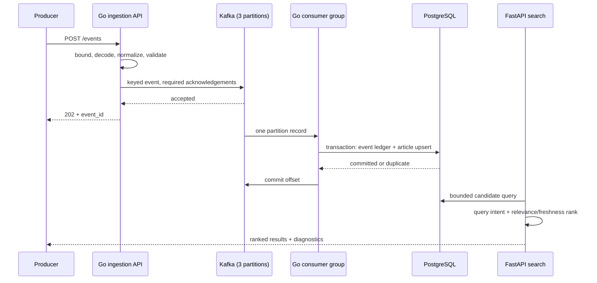

# Real-time search architecture

NewsLens originally answered an offline recommendation question: which ranking
decisions still hold under a chronological evaluation? The real-time path asks a
different question: how does a newly published article become searchable without
turning the research code into an unbounded in-process queue?

The implementation separates event transport from search serving. A small Go
service accepts and validates article events, Kafka absorbs bursts and assigns
ordered partitions, Go consumers write idempotently to PostgreSQL, and FastAPI
retrieves and ranks the searchable records. This keeps the existing MIND
recommendation route intact while adding an independently ready search route.

## Request and event flow



The producer response means Kafka accepted the event. It does not mean the
article is already searchable. Produced-to-indexed time is stored with each
article and returned as `index_freshness_ms`; the benchmark polls the search API
and records the distribution separately from publish latency.

## Event contract

`POST /events` accepts one JSON object no larger than 1 MiB:

```json
{
  "event_id": "publisher-unique-id",
  "article_id": "article-123",
  "title": "Apple launches an AI chip",
  "category": "technology",
  "published_at": "2026-08-23T12:00:00Z",
  "body": "Article text",
  "produced_at": "2026-08-23T12:00:01Z"
}
```

`article_id`, `title`, `category`, and `published_at` are required. The API can
generate `event_id` and `produced_at`, though stable publisher-supplied event IDs
are preferred because they provide retry idempotency. Unknown fields, multiple
JSON objects, missing fields, excessive strings, and oversized payloads are
rejected before Kafka.

Events are keyed by `article_id`. Kafka therefore preserves order for changes to
one article within a partition, while unrelated articles can be handled in
parallel across three partitions.

## Delivery and consistency semantics

Kafka consumption is at least once. A consumer queues an offset for commit only
after the PostgreSQL transaction succeeds or the event is placed on the
dead-letter topic. Kafka flushes those commits every second, so a crash can
redeliver the most recent successful records; the database idempotency boundary
handles that window.

PostgreSQL turns redelivery into an idempotent operation:

1. `realtime_ingestion_events.event_id` is the idempotency key.
2. The event ledger insert and article upsert share one transaction.
3. An existing event ID is counted as a duplicate and leaves the article alone.
4. A different event ID may update the article only when its `produced_at` is not
   older than the stored version.

The result is effectively-once database mutation for a stable event ID, built on
at-least-once delivery. It is not global exactly-once delivery: an external side
effect added outside this transaction would need its own idempotency boundary.

Search is read-after-index, not read-after-publish. PostgreSQL is the current
searchable store, so a successful consumer transaction becomes visible to new
queries without a separate index refresh job.

## Consumer groups, retries, and dead letters

The local stack starts two consumers with one group ID. Kafka assigns each
partition to at most one active group member and rebalances when a member enters
or leaves. A two-second heartbeat and six-second session timeout bound local
process-failure detection. Processing stays deliberately synchronous inside each consumer. That
bounds memory and lets Kafka retain the backlog when PostgreSQL is slower than
the producer.

Database writes receive three bounded attempts by default with increasing
100 ms delays. Invalid events skip database retries. Invalid events and exhausted
writes are published to `news-events-dlq` with their source location, failure
reason, timestamp, and base64-encoded original bytes. The source offset is
committed only after the dead-letter write succeeds, so a DLQ outage does not
silently discard the record.

Kafka fetch failures also back off up to one second instead of forming a hot
retry loop.

## Backpressure and overload behavior

The HTTP producer performs a synchronous Kafka write with required broker
acknowledgements and a five-second request deadline. Slow or unavailable Kafka
therefore slows or rejects producers instead of filling an in-memory queue.

Consumers fetch and process one record at a time. When PostgreSQL slows, consumer
lag grows in Kafka; records are not accumulated in application memory. The API
limits event bodies to 1 MiB and search retrieval to a configurable bounded
candidate count (`NEWSLENS_REALTIME_CANDIDATE_LIMIT`, default 200).

These choices favor an inspectable failure mode over maximum throughput. Batch
writes and asynchronous producer buffering should only be introduced with
measured latency, loss, and memory budgets.

## Query understanding and ranking

The search endpoint normalizes whitespace and extracts three small, inspectable
signals:

- a category from deterministic keyword groups;
- a capitalized or uppercase entity phrase; and
- freshness intent from words such as `latest`, `today`, and `breaking`.

PostgreSQL applies category and entity filters when they have matches, then
returns a recent bounded candidate set. Ranking combines lexical overlap,
exponential freshness decay, and log-normalized popularity. Freshness receives a
20% weight only when the query asks for recent information; otherwise that weight
returns to relevance. Responses expose every component so a surprising order can
be inspected rather than attributed to an opaque score.

The deterministic contract fixture in
[`reports/realtime_search_evaluation_v0_1.json`](../reports/realtime_search_evaluation_v0_1.json)
contains six hand-labeled queries and ten articles. It is useful evidence that
the intended rules work, but it is too small and synthetic for a general search
quality claim.

## Observability

Every Go process exposes:

- `GET /health` for process liveness;
- `GET /ready` for its configured Kafka or PostgreSQL dependencies; and
- `GET /metrics` in Prometheus text format.

Metrics cover accepted, processed, duplicate, invalid, dead-lettered, and failed
events, consumer lag when reported by the Kafka client, and the last
produced-to-indexed duration. Prometheus scrapes the producer and both consumers.
The Python API retains request IDs, process time, structured search completion
logs, and per-result index freshness.

The local metrics are signals, not an alerting policy. Production operation would
still need durable metric storage, dashboards, paging thresholds, and an owned
DLQ replay process.

## Failure behavior

| Failure | Visible behavior | Recovery path | Data-loss boundary |
|---|---|---|---|
| One consumer stops | Kafka rebalances its partitions to the other consumer | Restart the process; idempotency absorbs redelivery | No loss expected while Kafka retains the event |
| All consumers stop | Publish can continue and lag grows; new articles are not searchable | Restore a consumer and drain the backlog | Kafka retention policy |
| PostgreSQL is unavailable | Writes retry, then move to DLQ if Kafka remains available | Restore PostgreSQL and replay reviewed DLQ events | DLQ retention and replay discipline |
| Kafka is unavailable | Producer readiness fails and `POST /events` returns 503/504 | Restore Kafka and let producers retry with the same event ID | Producer retry policy |
| Consumer crashes after DB commit | Kafka may redeliver the same event | Ledger recognizes the event ID as a duplicate | Stable event ID required |
| Older article update arrives late | Event is recorded but cannot overwrite a newer article version | No operator action | Producer timestamps must be trustworthy |
| Invalid payload reaches Kafka | Consumer writes the bytes and reason to DLQ | Correct the producer or replay a repaired event | DLQ retention |

## Scaling boundaries

Consumer parallelism cannot usefully exceed the number of Kafka partitions. Add
partitions before adding more active consumers, while accounting for the fact
that partition increases change key distribution. PostgreSQL is the shared write
and search bottleneck; connection-pool, index, query, and write amplification
must be measured before horizontal API scaling is treated as capacity evidence.

The included Compose topology is a single-host development system with one Kafka
broker and one PostgreSQL instance. It demonstrates component boundaries and
failure handling, not broker replication, database high availability, multi-zone
recovery, or production capacity.
